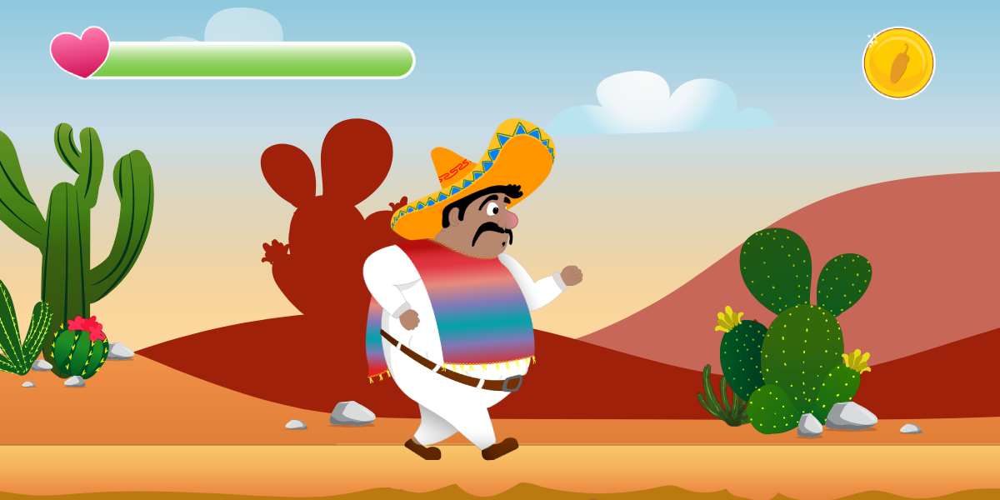
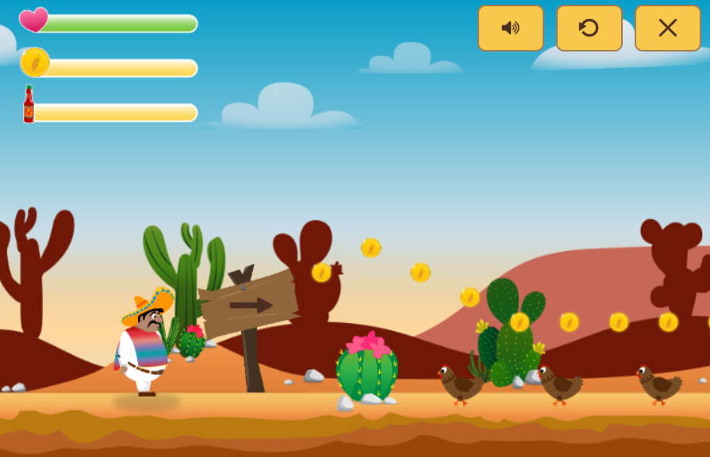
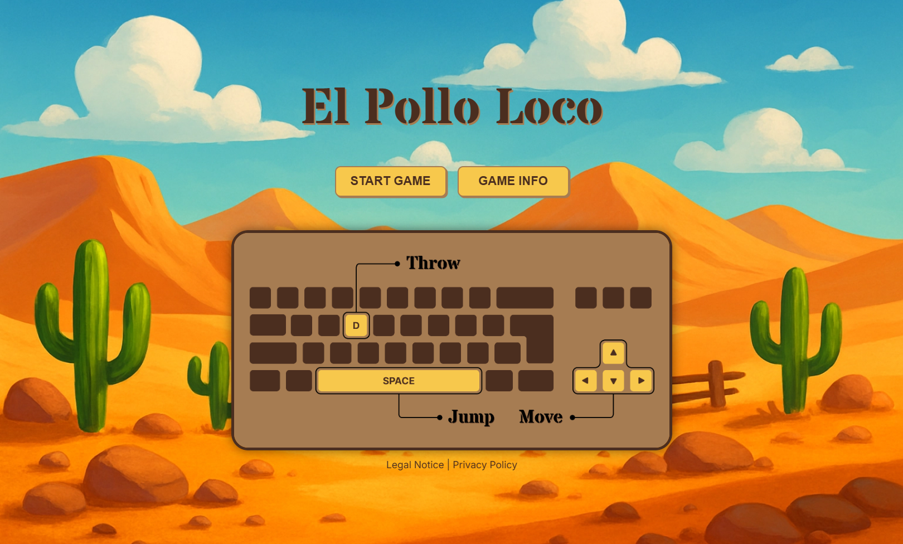

# El Pollo Loco

A 2D object-oriented platformer rendered with HTML5 Canvas.

## Documentation
📖 [Project Documentation](https://simcommit.github.io/el-pollo-loco/)

## Gameplay & Features
- Side-scrolling platformer with jumping and combat mechanics
- Collectable items:
  - Coins
  - Salsa bottles (used as throwable weapons)
- Health system:
  - Taking damage from enemies and environmental hazards
  - Restoring health by collecting coins
- Multiple enemy types with distinct behaviors
- Boss fight in a dedicated arena
- Some enemies can be used to the player's advantage

## Controls & Platforms
- Desktop: keyboard controls
- Mobile devices: touch controls

